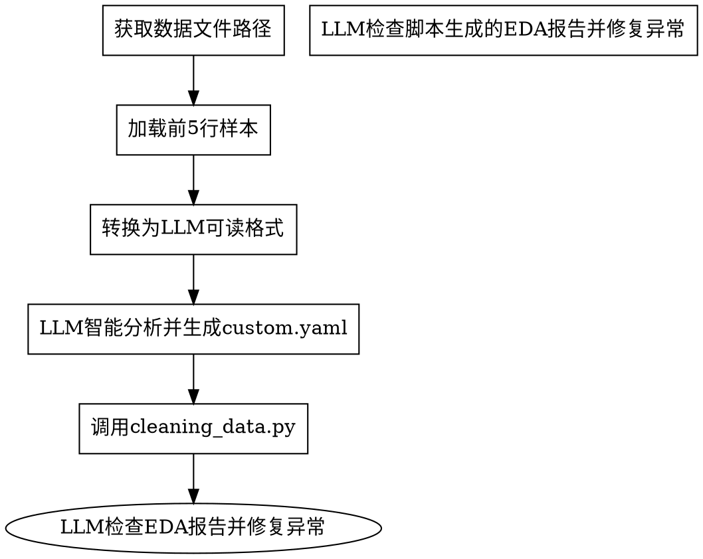

# Analyzing Data for Cleaning

## 1 概述

**使用流程：** 用户上传数据文件 → 加载前5行 → LLM 智能分析生成 custom.yaml → 调用 cleaning_data.py 执行清洗 → LLM检查脚本生成的EDA报告并修复异常

**核心原则：** 永远不要加载整个数据集到 LLM 上下文，但必须加载前5行让 LLM 理解数据含义和业务语义。

## 2 快速参考

### 2.1 运行命令

```bash
# 优先级1：上传文件后（文件在工作目录）
python3 scripts/cleaning_data.py -c configs/custom.yaml -i 终端默认目录/数据文件名.csv

# 优先级2：指定路径
python3 scripts/cleaning_data.py -c configs/custom.yaml -i /path/to/data.csv

# 优先级3：使用 data/ 目录下的文件
python3 scripts/cleaning_data.py -c configs/custom.yaml

```

### 2.2 数据获取方式

| 优先级 | 方式 | 说明 |
|-------|------|------|
| 1 | 用户上传文件 | 从本地上传文件到 Claude 终端，上传后保存在终端默认的工作目录 |
| 2 | 用户指定路径 | 通过 `-i` 参数指定数据路径 |
| 3 | 缺省目录 | 自动扫描 `data/` 目录下的数据文件 |

### 2.3 支持的文件格式
- `.csv` - CSV 文件（编码 utf-8-sig）
- `.xlsx` / `.xls` - Excel 文件

## 3 核心流程



## 4 第一阶段：数据准备

### 执行步骤

1. **定位数据文件路径** - 检查 data/ 目录或用户指定路径
2. **加载前5行样本** - 使用 pandas 读取
3. **转换为LLM可读格式** - 输出列信息（列名、类型、样本值）
4. **打印前5行完整数据**

### 代码实现

```python
import pandas as pd
from pathlib import Path

# 步骤1：定位数据文件路径
path = 'data/raw_data.csv'
ext = Path(path).suffix.lower()

# 步骤2：加载前5行样本
if ext == '.csv':
    df = pd.read_csv(path, encoding='utf-8-sig', nrows=5)
else:
    df = pd.read_excel(path, nrows=5)

# 步骤3：转换为LLM可读格式
print('=== 数据样本（仅前5行）===\n')
print('## 列信息 ##')
for col in df.columns:
    dtype = df[col].dtype
    non_null = df[col].dropna()
    sample = non_null.head(5).astype(str).tolist()
    print(f'- {col} ({dtype}), 样本: {sample}')

# 步骤4：打印前5行完整数据
print('\n## 前5行完整数据 ##')
print(df.head().to_string())
```

## 5 第二阶段：LLM 生成配置

### 5.1 LLM 智能分析维度

**这是核心步骤！** 将数据样本喂给 LLM，让它基于业务语义判断核心业务规则。

**让 LLM 基于以下3个维度智能判断：**

| 判断维度 | LLM 分析内容 | 生成配置字段 |
|---------|-------------|-------------|
| 异常值范围 | 列名语义 + 业务常识 | `outliers.ranges` |
| 数值分箱 | 数值列的业务含义 | `transformations.binning` |
| 计算列 | 多列的业务关联性 | `transformations.computed_columns` |

**⚠️ LLM 必须严格限制在上述3个维度内分析，禁止主动生成其他配置！**

上述3个维度以外的配置由 `cleaning_data.py` 脚本自动检测和补充。

### 5.2 读取提示词模板

**执行步骤：**
1. **主动读取提示词模板** - `reference/prompt_generate_config.md`
2. **将数据样本喂给LLM** - 传递第一阶段输出的数据样本
3. **LLM基于上述3个维度分析** - 异常值范围、数值分箱、计算列

### 5.3 LLM 生成 custom.yaml

**执行步骤：**
1. **分析数据样本的列名语义和业务含义**
2. **仅在5.1节规定的3个维度内生成配置**
3. **输出的 YAML 仅包含**：`outliers.ranges`、`transformations.binning`、`transformations.computed_columns`

**输出示例：**

```yaml
# custom.yaml（精简版）
outliers:
  ranges:
    age: [0, 120]      # 年龄范围
    income: [0, null]  # 收入非负
transformations:
  binning:
    age:
      bins: [0, 18, 35, 50, 65, 120]
      labels: ["未成年", "青年", "中年", "壮年", "老年"]
  computed_columns:
    total: "price * quantity"  # 计算列
```

### 5.4 保存配置

**执行步骤：**
1. **使用 YAML 库保存配置**
2. **确保编码为 UTF-8**

```python
import yaml
from pathlib import Path

def save_custom_config(yaml_content: str, output_path: str = "configs/custom.yaml"):
    """保存 LLM 生成的 custom.yaml"""
    config = yaml.safe_load(yaml_content)
    Path(output_path).parent.mkdir(parents=True, exist_ok=True)
    with open(output_path, 'w', encoding='utf-8') as f:
        yaml.dump(config, f, allow_unicode=True, sort_keys=False, default_flow_style=False)

# 执行保存
save_custom_config(yaml_content)
```

## 6 第三阶段：执行清洗

### 代码实现

```bash
# 运行清洗
python3 scripts/cleaning-data.py -c configs/custom.yaml -i data/raw_data.csv
```

## 7 第四阶段：EDA 检查与修复

### 执行步骤

1. **查找最新的 EDA 报告** - 匹配 `data/EDA-data_*.json`
2. **读取 EDA 报告内容** - 使用 json.load()
3. **主动读取提示词模板** - `reference/prompt_eda_analysis.md`
4. **分析以下异常并输出报告**：
   - 数据类型异常（如 std 为 NaN）
   - 列数异常（如解析错误）
   - 缺失值分布
   - 异常值检测结果
   - **分类列输入变体** - 检查 `categorical_distributions` 中是否有低频值（如出现1次的可能是输入错误）
5. **如发现问题，更新 custom.yaml 重新运行第三阶段**

### 代码实现

```python
import glob
import json
from pathlib import Path

# 步骤1：查找最新的 EDA 报告
eda_files = glob.glob("data/EDA-data_*.json")
if not eda_files:
    raise FileNotFoundError("未找到 EDA 报告")
latest_file = max(eda_files, key=lambda f: Path(f).stat().st_mtime)

# 步骤2：读取 EDA 报告内容
with open(latest_file, 'r', encoding='utf-8') as f:
    eda_report = json.load(f)

# 步骤3-4：分析异常（提示词模板在 reference/prompt_eda_analysis.md）

# 步骤5：如发现问题，更新配置后重新运行第三阶段
```

### EDA 分析报告模板

**状态：** 正常 / 存在问题

#### 发现的问题

| 问题类型 | 详情 | 原因分析 | 修复建议 |
|---------|------|---------|---------
| std为NaN | income列 | 数据类型可能是字符串 | 转换为数值类型 |
| 列数过少 | 只有1列 | 列名解析错误 | 检查CSV分隔符 |
| 分类输入变体 | 住建局限、税物局等 | 部门名称输入错误 | 配置 value_correction 纠正 |

### 修复后的 custom.yaml 配置

```yaml
format_standardization:
  numeric_columns: ["income"]  # 强制转换
  value_correction:            # 字段值纠正
    部门:
      allowed_values: [民政局, 人社局, 市场监管局, 住建局, 税务局]
      threshold: 0.6
```

## 8 常见错误

| 错误 | 原因 | 解决方案 |
|------|------|---------|
| LLM生成配置不完整 | 未提供足够样本 | 确保加载前5行，让LLM看到实际数据 |
| 日期列识别错误 | 正则规则太简单 | 让LLM根据列名和样本值综合判断 |
| 范围设置不合理 | 未理解列语义 | 让LLM根据列名的业务含义设置 |
| 分类编码混乱 | 枚举值顺序随意 | 让LLM保持语义一致的映射顺序 |
| 字段值纠正遗漏 | 分类列存在输入变体未检测 | 检查EDA报告中的分类频率，配置value_correction |
